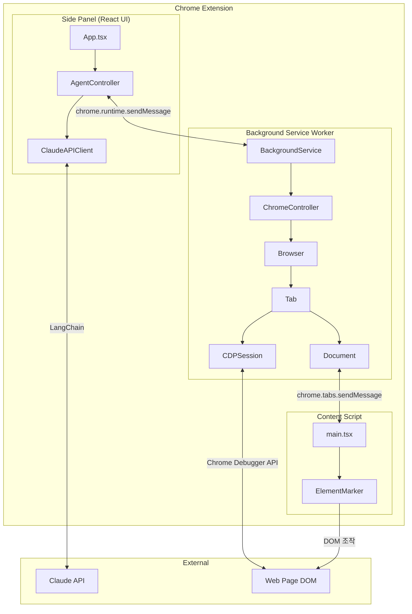
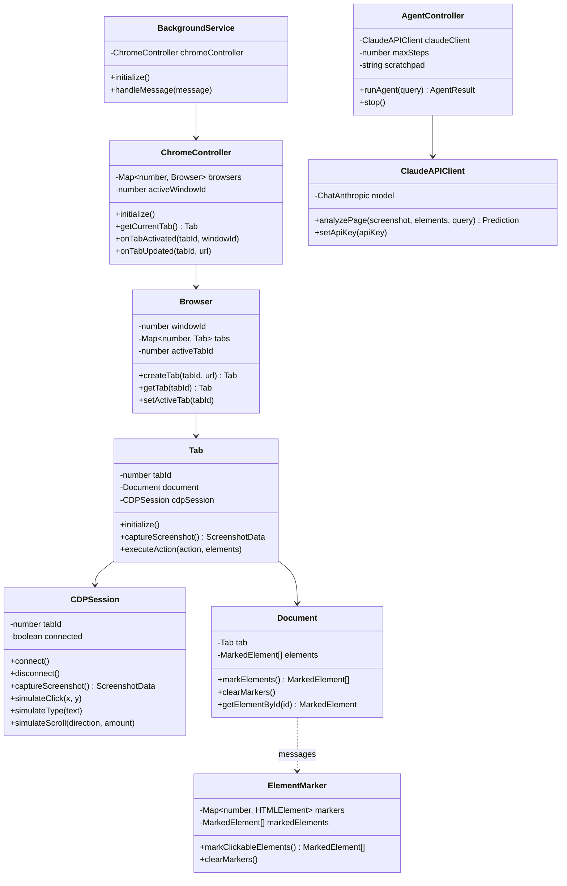
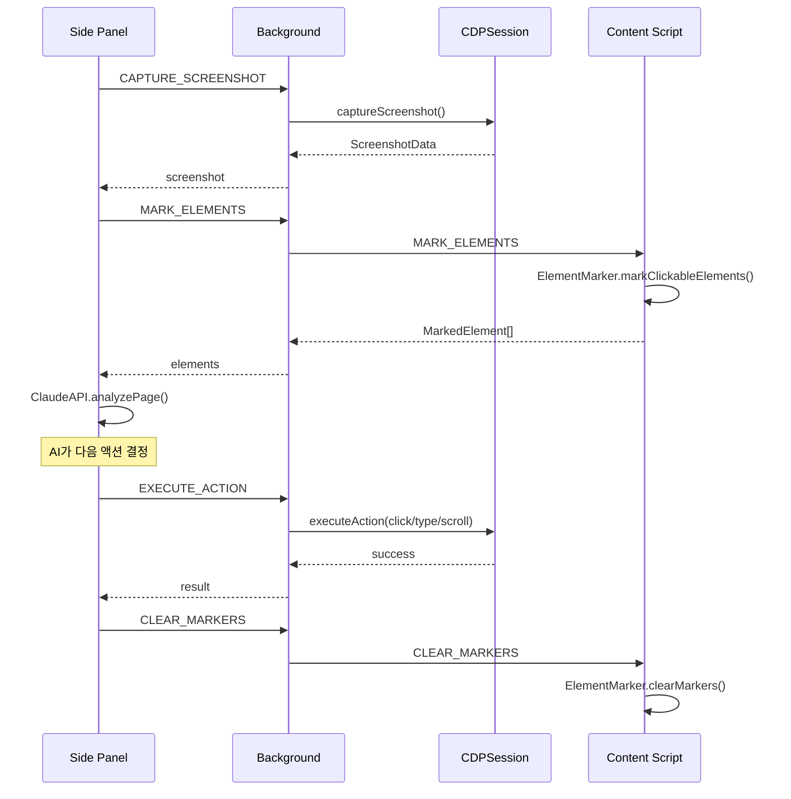

# Web Voyager Extension

Claude AI 기반 웹 자동화 Chrome 확장 프로그램입니다. 자연어 명령으로 웹페이지를 조작할 수 있습니다.

## 데모

[](https://youtu.be/8_VFAAFScOg)

## 주요 기능

- **스크린샷 캡처**: 현재 페이지를 자동으로 캡처
- **요소 마킹**: 클릭 가능한 요소를 번호로 표시
- **AI 자동화**: Chrome DevTools Protocol을 통한 정밀한 브라우저 제어
- **자연어 인터페이스**: "구글에서 ChatGPT 검색해줘" 같은 명령 지원

## 지원 액션

- **Click**: 요소 클릭
- **Type**: 텍스트 입력
- **Scroll**: 페이지/요소 스크롤
- **Navigate**: 페이지 이동
- **Wait**: 대기

## 설치 및 실행

```bash
# 의존성 설치
npm install

# 개발 서버 실행
npm run dev

# 프로덕션 빌드
npm run build
```

### Chrome에 확장 프로그램 로드

1. `chrome://extensions` 접속
2. 개발자 모드 ON
3. "압축해제된 확장 프로그램 로드" 클릭
4. `dist` 폴더 선택

## 사용법

1. 웹페이지에서 Extension 아이콘 클릭
2. Side Panel 열기
3. Claude API 키 입력
4. 자연어 명령 입력 (예: "구글에서 ChatGPT 검색해줘")
5. AI가 자동으로 작업 수행

## 기술 스택

- **Framework**: React 19 + TypeScript
- **Build Tool**: Vite + CRXJS Plugin
- **AI**: LangChain + Anthropic Claude API
- **Chrome APIs**: Manifest V3, Debugger API, Tabs API
- **Automation**: Chrome DevTools Protocol

## 프로젝트 구조

```
src/
├── background/          # Background Service Worker
│   ├── main.ts          # 진입점
│   ├── chrome-controller.ts
│   ├── browser.ts
│   ├── tab.ts
│   ├── document.ts
│   └── cdp-session.ts   # Chrome DevTools Protocol
├── content/             # Content Scripts
│   ├── main.tsx
│   └── marker.ts        # 요소 마킹
├── sidepanel/           # Side Panel UI
│   ├── App.tsx          # React 채팅 인터페이스
│   ├── agent-controller.ts
│   └── claude-api.ts    # Claude API 클라이언트
└── shared/
    └── types.ts         # 공용 타입 정의
```

## 아키텍처

### 시스템 구조



### 클래스 다이어그램



### 메시지 흐름


